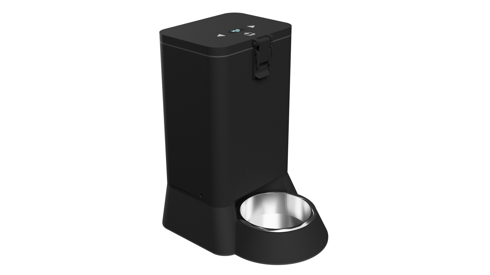
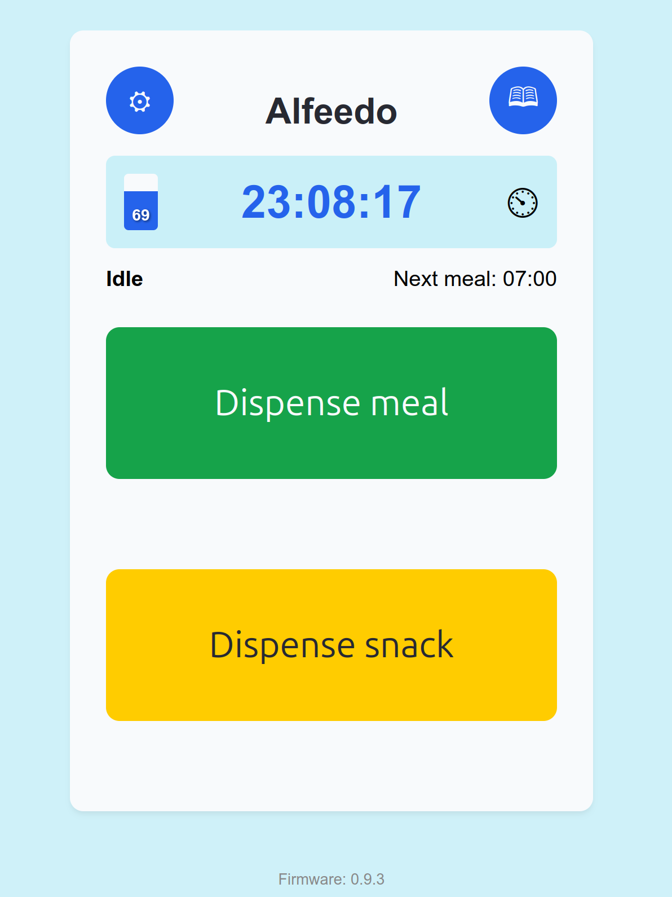
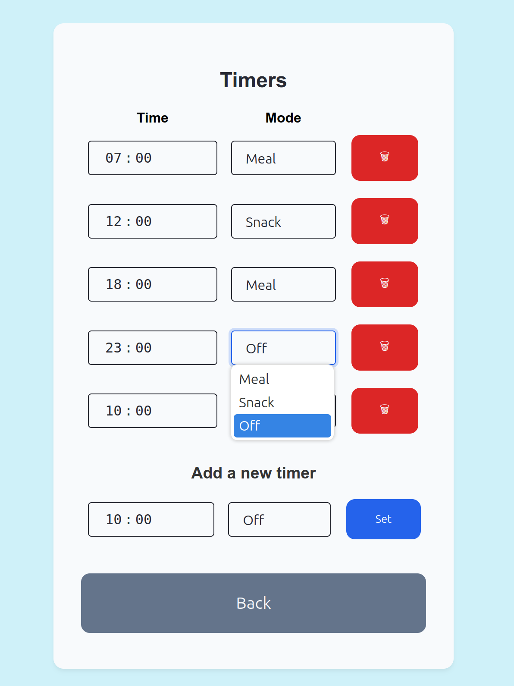
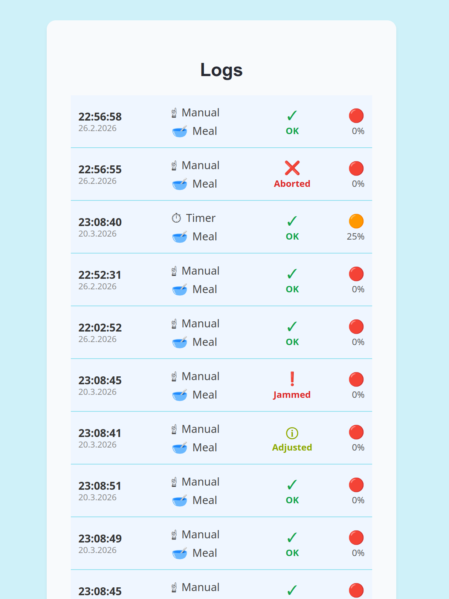
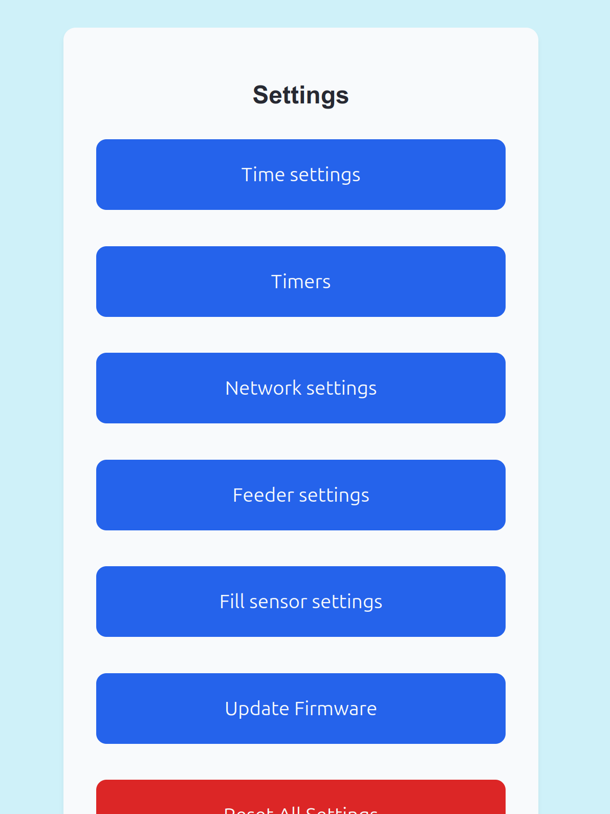

# Alfeedo

A fully featured, smart home integrated cat feeder. 

This repository contains the firmware for the 3D printed cat feeder Alfeedo.

## Features

* Controls a TMC2209 stepper motor to dispense food (including jam detection and recovery)
* Supports operation and setup using a 128x32 display and Buttons
* Built-in web interface
* REST API

| Main view | Timer settings | Logs | Settings |
| :--- | :--- | :--- | :--- |
|  |  |  |  |

## How to build

3D print model files along with a bill of materials are available on Makerworld. 

[Makerworld - Alfeedo](https://makerworld.com/en/models/2506745-alfeedo-smart-cat-feeder)

Follow print and assembly instructions provided with the model files.

Electronics wiring can be simplified by ordering the Alfeedo PCB using the provided Gerber files in [pcb/](https://github.com/mzanetti/alfeedo/tree/main/pcb).

Flash the device using the [web flasher](https://mzanetti.github.io/alfeedo/main/flasher/).

Note that the provided firmware assumes wiring to look like on the Alfeedo PCB. If instead you prefer using a different setup, you'll have to build the firmware yourself and adjust the pins in hwsettings.h.

## Building

This project is based on [platformio](https://platformio.org/).

